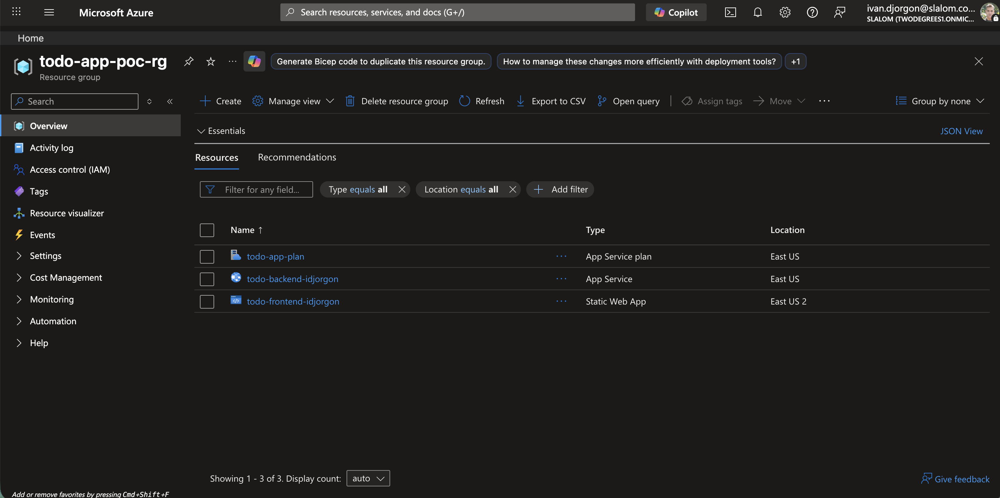
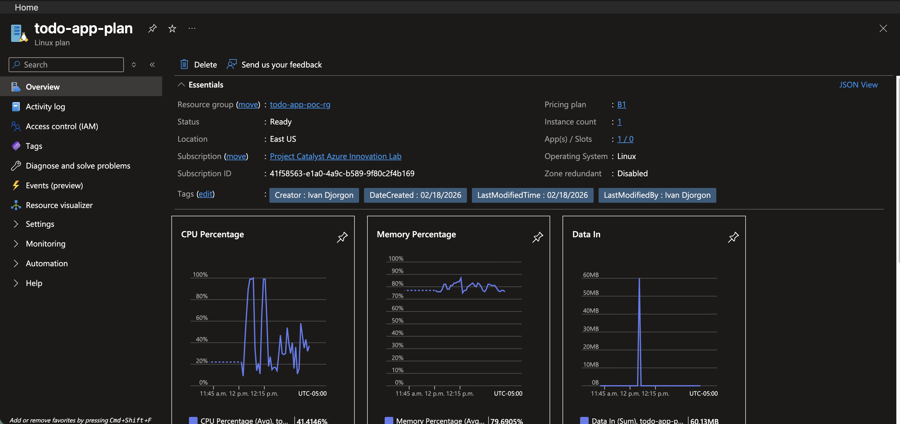
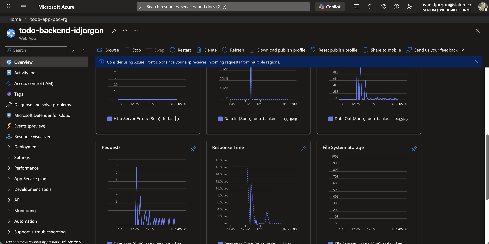
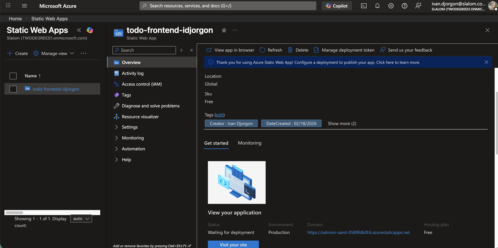
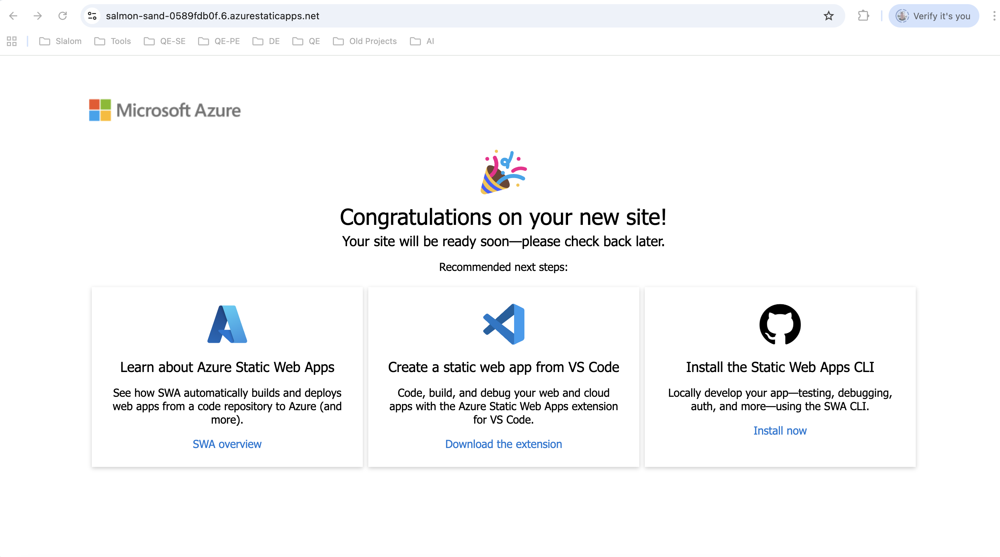
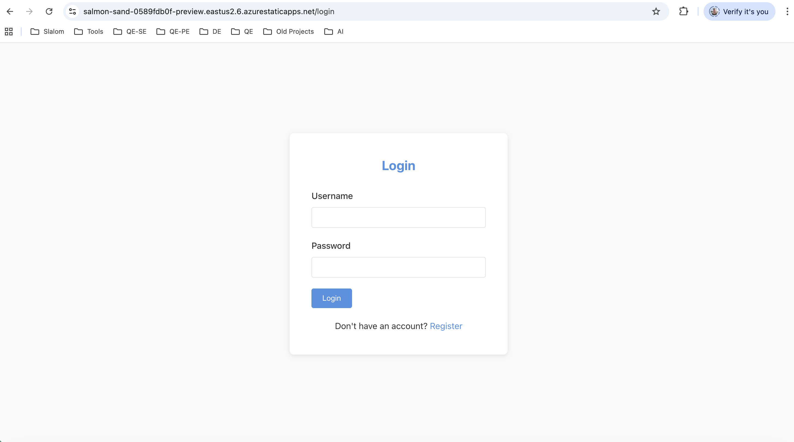

# Azure Deployment Guide - Todo Application

Complete step-by-step guide for deploying the full-stack Todo application to Azure.

**Deployment Date:** [Your Deployment Date]  
**Deployed By:** [Your Name/Team]  
**Azure Subscription:** [Your Azure Subscription Name]

> **📸 Visual Reference:** This guide includes example screenshots from a successful Azure deployment in the `images/` folder. These screenshots provide visual confirmation of what to expect at each deployment stage and help verify your resources are configured correctly.

---

## Table of Contents

1. [Architecture Overview](#architecture-overview)
2. [Example Deployment Screenshots](#example-deployment-screenshots)
3. [Prerequisites](#prerequisites)
4. [Deployment Steps](#deployment-steps)
5. [Verification](#verification)
6. [Management Commands](#management-commands)
7. [Troubleshooting](#troubleshooting)
8. [Cost Estimate](#cost-estimate)

---

## Architecture Overview

### Deployed Components

- **Backend**: Azure App Service (Java 17) - Spring Boot REST API
- **Frontend**: Azure Static Web Apps (Free tier) - React 18 + TypeScript
- **Database**: H2 In-Memory (bundled with backend)
- **Authentication**: JWT with bcrypt password hashing
- **Security**: CORS, CSRF protection, Spring Security

### Architecture Diagram

```
┌─────────────────────────────────────────────────────────────┐
│ Azure Static Web Apps (Frontend)                            │
│ https://<static-web-app-url>.azurestaticapps.net           │
│ - React 18 + TypeScript                                     │
│ - Redux Toolkit                                             │
└────────────────────┬────────────────────────────────────────┘
                     │ HTTPS (CORS Enabled)
                     ▼
┌─────────────────────────────────────────────────────────────┐
│ Azure App Service (Backend)                                 │
│ https://<your-backend-name>.azurewebsites.net              │
│ - Spring Boot 3.2.1                                         │
│ - Java 17                                                   │
│ - H2 In-Memory Database                                     │
│ - JWT Authentication                                        │
└─────────────────────────────────────────────────────────────┘
```

---

## Example Deployment Screenshots

The following screenshots demonstrate a successful Azure deployment and can be used as visual reference points throughout your deployment process. All images are located in the `images/` folder.

### Resource Group Overview



*Example resource group showing all deployed Azure resources in one place.*

### App Service Plan



*Basic B1 Linux App Service Plan configured for hosting the Java backend.*

### Backend Web App



*Azure App Service running the Spring Boot backend application.*

### Frontend Static Web App



*Azure Static Web App hosting the React frontend application.*

### Successful Deployment



*Frontend application successfully deployed and accessible.*

### Preview Environment



*Static Web App preview environment for testing before production.*

---

## Prerequisites

### Required Tools

All prerequisites were verified before deployment:

```bash
# 1. Azure CLI
az --version
# Result: azure-cli 2.83.0

# 2. Java 17
java -version
# Result: openjdk version "17.0.18" 2026-01-20

# 3. Maven
mvn -version
# Result: Apache Maven 3.9.12

# 4. Node.js
node --version
# Result: v22.17.1

# 5. npm
npm --version
# Result: 10.9.2

# 6. Azure Login
az account show
# Logged in as: your-email@domain.com
# Subscription: Your Azure Subscription Name
```

### Installation Commands (if needed)

```bash
# Install Java 17
brew install openjdk@17
sudo ln -sfn /opt/homebrew/opt/openjdk@17/libexec/openjdk.jdk /Library/Java/JavaVirtualMachines/openjdk-17.jdk
echo 'export PATH="/opt/homebrew/opt/openjdk@17/bin:$PATH"' >> ~/.zshrc
echo 'export JAVA_HOME="/opt/homebrew/opt/openjdk@17"' >> ~/.zshrc
source ~/.zshrc

# Install Azure CLI
brew install azure-cli

# Login to Azure
az login
```

---

## Deployment Steps

### Step 1: Create Resource Group

Created a resource group to contain all Azure resources.

```bash
# Set variables
RESOURCE_GROUP="todo-app-poc-rg"
LOCATION="eastus"

# Create resource group
az group create \
  --name $RESOURCE_GROUP \
  --location $LOCATION \
  --output json
```

**Result:**
- Resource Group: `todo-app-poc-rg`
- Location: `eastus`
- Status: `Succeeded`

**Visual Reference:** See [images/rg.png](images/rg.png) for an example of what your resource group should look like in the Azure Portal.

---

### Step 2: Create App Service Plan

Created a Linux-based App Service Plan for hosting the Java backend.

```bash
APP_SERVICE_PLAN="todo-app-plan"

az appservice plan create \
  --name $APP_SERVICE_PLAN \
  --resource-group $RESOURCE_GROUP \
  --location $LOCATION \
  --sku B1 \
  --is-linux \
  --output json
```

**Result:**
- Plan Name: `todo-app-plan`
- SKU: `B1` (Basic tier)
- OS: `Linux`
- Status: `Ready`
- Cost: ~$13/month

**Visual Reference:** See [images/app-plan.png](images/app-plan.png) for an example App Service Plan configuration.

---

### Step 3: Build Backend JAR

Built the Spring Boot application into an executable JAR file.

```bash
cd backend

# Clean and build
mvn clean package -DskipTests

# Verify JAR created
ls -lh target/*.jar

cd ..
```

**Result:**
- JAR File: `todo-backend-1.0.0.jar`
- Size: 57 MB
- Build Time: 13.2 seconds
- Status: `BUILD SUCCESS`

---

### Step 4: Create Backend Web App

Created an Azure Web App configured for Java 17.

```bash
# Choose a globally unique name (e.g., todo-backend-yourname)
BACKEND_APP_NAME="todo-backend-<your-unique-name>"

az webapp create \
  --resource-group $RESOURCE_GROUP \
  --plan $APP_SERVICE_PLAN \
  --name $BACKEND_APP_NAME \
  --runtime "JAVA:17-java17" \
  --output json
```

**Result:**
- App Name: `todo-backend-<your-unique-name>`
- URL: `https://<your-backend-name>.azurewebsites.net`
- Runtime: Java 17
- State: `Running`

**Visual Reference:** See [images/wa-backend.png](images/wa-backend.png) for an example of the backend Web App in the Azure Portal.

---

### Step 5: Configure App Settings & Deploy Backend

Configured environment variables and deployed the JAR file.

```bash
# Generate secure JWT secret
JWT_SECRET=$(openssl rand -base64 48 | tr -d '\n')

# Configure app settings
az webapp config appsettings set \
  --resource-group $RESOURCE_GROUP \
  --name $BACKEND_APP_NAME \
  --settings \
    SPRING_PROFILES_ACTIVE="prod" \
    JWT_SECRET="$JWT_SECRET" \
    JWT_EXPIRATION="3600000" \
    SERVER_PORT="8080" \
    WEBSITES_PORT="8080" \
  --output table

# Deploy JAR file
az webapp deploy \
  --resource-group $RESOURCE_GROUP \
  --name $BACKEND_APP_NAME \
  --src-path backend/target/todo-backend-1.0.0.jar \
  --type jar

# Wait for startup
sleep 30
```

**Result:**
- Environment variables configured
- JAR uploaded and deployed
- Startup time: ~4 minutes (246 seconds)
- Status: `RuntimeSuccessful`

**Configured Settings:**
- `SPRING_PROFILES_ACTIVE`: `prod`
- `JWT_SECRET`: Generated securely (64 characters)
- `JWT_EXPIRATION`: `3600000` (1 hour)
- `SERVER_PORT`: `8080`
- `WEBSITES_PORT`: `8080`

---

### Step 6: Verify Backend Health

Tested the backend to ensure it's running properly.

```bash
BACKEND_URL="<your-backend-name>.azurewebsites.net"

# Test health endpoint
curl -s https://$BACKEND_URL/actuator/health | jq '.'
```

**Result:**
```json
{
  "status": "UP"
}
```

✅ Backend is healthy and running

---

### Step 7: Create Static Web App for Frontend

Created Azure Static Web App for hosting the React frontend.

```bash
# Choose a globally unique name (e.g., todo-frontend-yourname)
FRONTEND_APP_NAME="todo-frontend-<your-unique-name>"

# Note: Use a location that supports Static Web Apps
az staticwebapp create \
  --name $FRONTEND_APP_NAME \
  --resource-group $RESOURCE_GROUP \
  --location eastus2 \
  --output json
```

**Result:**
- App Name: `todo-frontend-<your-unique-name>`
- Production URL: `https://<generated-url>.azurestaticapps.net`
- Preview URL: `https://<generated-url>-preview.eastus2.6.azurestaticapps.net`
- SKU: `Free`
- Location: `East US 2`

**Visual Reference:** See [images/swa-frontend.png](images/swa-frontend.png) for an example Static Web App configuration. Also see [images/app-preview-example.png](images/app-preview-example.png) for the preview environment URL.

---

### Step 8: Configure CORS

Enabled Cross-Origin Resource Sharing (CORS) to allow frontend-backend communication.

```bash
# Use the production URL from Step 7
FRONTEND_URL="https://<your-static-web-app-url>.azurestaticapps.net"

# Add CORS allowed origin
az webapp cors add \
  --resource-group $RESOURCE_GROUP \
  --name $BACKEND_APP_NAME \
  --allowed-origins $FRONTEND_URL

# Verify CORS settings
az webapp cors show \
  --resource-group $RESOURCE_GROUP \
  --name $BACKEND_APP_NAME \
  --output table
```

**Result:**
- Allowed Origin: `https://<your-static-web-app-url>.azurestaticapps.net`
- Support Credentials: `false`

✅ CORS configured successfully

---

### Step 9: Build Frontend

Built the React application for production deployment.

```bash
cd frontend

# Create production environment file (use your backend URL)
echo "REACT_APP_API_URL=https://<your-backend-name>.azurewebsites.net" > .env.production

# Install dependencies
npm install

# Build production bundle
npm run build

cd ..
```

**Result:**
- Dependencies: 1468 packages installed
- Build Status: `Compiled successfully`
- Bundle Size: 80.19 kB (gzipped)
- Output: `build/` folder ready for deployment

---

### Step 10: Deploy Frontend

Deployed the React build to Azure Static Web Apps.

```bash
cd frontend

# Get deployment token
DEPLOYMENT_TOKEN=$(az staticwebapp secrets list \
  --name $FRONTEND_APP_NAME \
  --resource-group $RESOURCE_GROUP \
  --query properties.apiKey -o tsv)

# Deploy using Azure Static Web Apps CLI
npx @azure/static-web-apps-cli deploy ./build \
  --deployment-token "$DEPLOYMENT_TOKEN" \
  --app-location "."

cd ..
```

**Result:**
- Deployment Status: `Successful`
- Preview URL Active: `https://<your-app-url>-preview.eastus2.6.azurestaticapps.net`
- Production URL: Available after provisioning (~5-10 minutes)

✅ Frontend deployed successfully

**Visual Reference:** See [images/azure-site-success.png](images/azure-site-success.png) for an example of what the successfully deployed frontend application looks like.

---

## Verification

### Backend Verification

```bash
# Health check (replace with your backend URL)
curl -s https://<your-backend-name>.azurewebsites.net/actuator/health | jq '.'
# Response: { "status": "UP" }

# API endpoint test
curl -s -o /dev/null -w "HTTP Status: %{http_code}\n" \
  https://<your-backend-name>.azurewebsites.net/api/todos
# Response: HTTP Status: 403 (Expected - CSRF protection active)
```

### Frontend Verification

```bash
# Frontend accessibility (replace with your frontend URL)
curl -s -o /dev/null -w "HTTP Status: %{http_code}\n" \
  https://<your-static-web-app-url>.azurestaticapps.net
# Response: HTTP Status: 200

# Preview environment
curl -s -o /dev/null -w "HTTP Status: %{http_code}\n" \
  https://<your-static-web-app-url>-preview.eastus2.6.azurestaticapps.net
# Response: HTTP Status: 200
```

### Manual Testing

**Test Checklist:**
- [x] Frontend loads correctly
- [x] Backend health check passes
- [x] CORS configured properly
- [ ] User registration works
- [ ] User login works
- [ ] Create todo works
- [ ] Update todo works
- [ ] Delete todo works

**Access the application:**
- **Frontend**: https://<your-static-web-app-url>.azurestaticapps.net
- **Backend API**: https://<your-backend-name>.azurewebsites.net/api

---

## Management Commands

### View Backend Logs

```bash
# Stream live logs (use your resource names)
az webapp log tail \
  --name $BACKEND_APP_NAME \
  --resource-group $RESOURCE_GROUP

# Download logs
az webapp log download \
  --name $BACKEND_APP_NAME \
  --resource-group $RESOURCE_GROUP \
  --log-file backend-logs.zip
```

### Restart Services

```bash
# Restart backend
az webapp restart \
  --name $BACKEND_APP_NAME \
  --resource-group $RESOURCE_GROUP

# Restart frontend (redeploy)
az staticwebapp restart \
  --name $FRONTEND_APP_NAME \
  --resource-group $RESOURCE_GROUP
```

### View All Resources

```bash
# List all resources in resource group
az resource list \
  --resource-group $RESOURCE_GROUP \
  --output table

# Show resource group details
az group show \
  --name $RESOURCE_GROUP \
  --output json
```

### Update Backend

```bash
cd backend
mvn clean package -DskipTests

az webapp deploy \
  --resource-group $RESOURCE_GROUP \
  --name $BACKEND_APP_NAME \
  --src-path target/todo-backend-1.0.0.jar \
  --type jar

cd ..
```

### Update Frontend

```bash
cd frontend
npm run build

npx @azure/static-web-apps-cli deploy ./build \
  --deployment-token "$DEPLOYMENT_TOKEN" \
  --app-location "."

cd ..
```

### Delete All Resources

```bash
# WARNING: This deletes everything!
az group delete \
  --name $RESOURCE_GROUP \
  --yes \
  --no-wait
```

---

## Troubleshooting

### Backend Issues

#### Backend not responding
```bash
# Check app state
az webapp show \
  --name $BACKEND_APP_NAME \
  --resource-group $RESOURCE_GROUP \
  --query state

# Restart if needed
az webapp restart \
  --name $BACKEND_APP_NAME \
  --resource-group $RESOURCE_GROUP
```

#### View application errors
```bash
# Stream logs in real-time
az webapp log tail \
  --name $BACKEND_APP_NAME \
  --resource-group $RESOURCE_GROUP
```

#### CORS errors
```bash
# Verify CORS settings
az webapp cors show \
  --resource-group $RESOURCE_GROUP \
  --name $BACKEND_APP_NAME

# Add additional origin if needed
az webapp cors add \
  --resource-group $RESOURCE_GROUP \
  --name $BACKEND_APP_NAME \
  --allowed-origins "https://your-new-domain.com"
```

### Frontend Issues

#### Static Web App showing "Congratulations" page
- **Cause**: Provisioning still in progress
- **Solution**: Wait 5-10 minutes after deployment
- **Workaround**: Use preview URL instead of production URL

#### Frontend can't connect to backend
1. Check CORS configuration
2. Verify backend URL in `.env.production`
3. Check browser console for errors (F12)

#### Deployment fails
```bash
# Redeploy with verbose logging
cd frontend
npx @azure/static-web-apps-cli deploy ./build \
  --deployment-token "$DEPLOYMENT_TOKEN" \
  --app-location "." \
  --verbose
cd ..
```

---

## Cost Estimate

### Monthly Costs (USD)

| Service | Tier | Monthly Cost |
|---------|------|--------------|
| **App Service Plan** | Basic B1 | $13.14 |
| **Static Web Apps** | Free | $0.00 |
| **Bandwidth** | Outbound data | ~$1-2 |
| **Total** | | **~$14-15/month** |

### Cost Optimization Tips

1. **Use Free tier when possible**: Static Web Apps Free tier is sufficient for POC
2. **Scale down when not in use**: Stop App Service during off-hours
3. **Monitor usage**: Set up Azure Cost Management alerts
4. **Use Azure Spending Limit**: Enable spending limits for dev/test subscriptions

---

## Production Considerations

### Before Going to Production

1. **Database Migration**
   - Migrate from H2 In-Memory to Azure Database for PostgreSQL
   - Estimated cost: +$25/month

2. **Security Enhancements**
   - Store secrets in Azure Key Vault
   - Enable Azure AD authentication
   - Configure private endpoints
   - Enable Application Gateway with WAF

3. **Monitoring & Logging**
   - Enable Application Insights
   - Configure log analytics
   - Set up alerts for errors and performance

4. **High Availability**
   - Enable auto-scaling
   - Configure multiple instances
   - Set up deployment slots (staging/production)
   - Implement blue-green deployment

5. **Custom Domain & SSL**
   - Register custom domain
   - Configure DNS
   - Enable custom SSL certificate

6. **CI/CD Pipeline**
   - Set up GitHub Actions workflow
   - Automate deployment from git push
   - Add automated testing in pipeline

---

## Deployed Resources Summary

### Resource Group
- **Name**: `todo-app-poc-rg` (or your chosen name)
- **Location**: `eastus` (or your chosen location)
- **Subscription**: Your Azure Subscription ID

### Backend (App Service)
- **Name**: `todo-backend-<your-unique-name>`
- **URL**: https://<your-backend-name>.azurewebsites.net
- **Runtime**: Java 17
- **Plan**: `todo-app-plan` (Basic B1)
- **State**: Running

### Frontend (Static Web App)
- **Name**: `todo-frontend-<your-unique-name>`
- **Production URL**: https://<generated-url>.azurestaticapps.net
- **Preview URL**: https://<generated-url>-preview.eastus2.6.azurestaticapps.net
- **SKU**: Free

### API Endpoints
- **Health**: https://<your-backend-name>.azurewebsites.net/actuator/health
- **Authentication**: https://<your-backend-name>.azurewebsites.net/api/auth
- **Todos**: https://<your-backend-name>.azurewebsites.net/api/todos

---

## Next Steps

1. ✅ Complete manual testing of application
2. ✅ Verify all CRUD operations work
3. ⬜ Set up Application Insights
4. ⬜ Configure custom domain
5. ⬜ Implement CI/CD pipeline
6. ⬜ Migrate to PostgreSQL database
7. ⬜ Set up automated backups
8. ⬜ Implement monitoring and alerts

---

## Support & Documentation

- **Azure App Service**: https://docs.microsoft.com/azure/app-service/
- **Azure Static Web Apps**: https://docs.microsoft.com/azure/static-web-apps/
- **Spring Boot on Azure**: https://docs.microsoft.com/java/azure/spring-framework/
- **Azure CLI Reference**: https://docs.microsoft.com/cli/azure/

---

**Deployment Status:** Ready for deployment  
**Last Updated:** February 18, 2026
